# Career-Flow AI 🤖💼

**About:** AI-powered career automation agent that monitors job boards, intelligently matches opportunities to your resume, generates tailored applications, and handles submissions with human oversight and approval.

[](https://github.com/Khimira/Career-Flow-AI)
[](https://n8n.io)
[](LICENSE)

## 📋 Table of Contents

- [Overview](#-overview)
- [Features](#-features)
- [Workflow Architecture](#-workflow-architecture)
- [Execution Flow](#-execution-flow)
- [Prerequisites](#-prerequisites)
- [Installation](#-installation)
- [Customization](#-customization)
- [Troubleshooting](#-troubleshooting)

## 🎯 Overview

**Career-Flow AI** is an intelligent automation agent built with n8n that revolutionizes the job search process. It continuously monitors multiple job sources, analyzes compatibility using AI, generates personalized applications, and sends submissions - all with human supervision.

### How It Works

1. **Automated Collection**: Monitors RSS feeds and LinkedIn scraping every hour
2. **Intelligent Deduplication**: Prevents processing duplicate jobs using Google Sheets
3. **AI Analysis**: Uses Gemini AI to evaluate technical and cultural fit
4. **Content Generation**: Automatically creates personalized cover letters
5. **Human Approval**: Sends Discord notification for final review
6. **Automated Sending**: Emails professional application with PDF attachment

## ✨ Features

- **Continuous Monitoring**: Runs hourly across multiple sources
-  **Intelligent Matching**: AI analyzes technical requirements and soft skills
-  **Personalized Letters**: Automatic generation using Gemini AI
-  **Manual Approval**: Validation system via Discord webhook
-  **Complete Tracking**: Application history in Google Sheets
-  **Anti-Duplication**: Automatically prevents duplicate applications
-  **Professional Email**: SMTP sending with PDF cover letter attached
-  **Multi-Source**: WeWorkRemotely, RemoteOK, HackerNews and LinkedIn

## 🏗 Workflow Architecture


## 🔄 Execution Flow

### 1️⃣ **Data Collection**

The workflow starts with multiple triggers running on staggered schedules:

- **00:00** - RSS Feed: WeWorkRemotely
- **00:10** - RSS Feed: RemoteOK  
- **00:20** - RSS Feed: HackerNews
- **00:30** - Python Scraper: LinkedIn (via JobSpy)

Each source returns a feed of jobs with title, link, description and metadata.

### 2️⃣ **Deduplication**

```javascript
// Deduplication process
1. Fetch complete history from Google Sheets
2. Merge new jobs (RSS) with history (Sheets)
3. Compare normalized links using JavaScript Set()
4. Filter only new jobs (not previously processed)
5. Limit execution to 1 job at a time for control
```

**Benefits:**
-  Prevents duplicate application spam
-  O(1) performance using Set
-  URL normalization (removes parameters)
-  Multi-source support

### 3️⃣ **Content Extraction**

**Jina AI Reader:**
```
URL Input: https://example.com/job-posting
Jina Transform: https://r.jina.ai/https://example.com/job-posting
Output: Clean markdown text with full description
```

**Resume:**
- Reads document from Google Docs
- Extracts full text in markdown format
- Prepares variables for analysis

### 4️⃣ **Compatibility Analysis**

**Gatekeeper Prompt (Gemini AI):**

```json
{
  "role": "HR Analyst specialized in Tech",
  "task": "Evaluate technical and soft skills match",
  "inputs": {
    "curriculum": "{{ my_resume }}",
    "job_description": "{{ job_text }}"
  },
  "output_format": {
  "match": boolean,
  "detected_level": "Junior" | "Mid-level" | "Senior" | "Specialist",
  "contact_email": "string",
  "summary": "short string",
  "justification": "Explain in 1 sentence why it matched or not"
  }
}
```

**Approval Criteria:**
- Technical Score > 75
- No critical red flags
- Final Decision = "approved"

### 5️⃣ **Decision and Routing**

```mermaid
graph LR
    A[AI Analysis] --> B{Match > 75%?}
    B -->|Yes| C{Has Email?}
    B -->|No| D[❌ Discord: No Match]
    C -->|Yes| E[✅ Generate Application]
    C -->|No| F[⚠️ Discord: No Email]
```



**Google Sheets Registration:**


| Timestamp | Job Title | Match | Link |
|-----------|-------|-------|----------|------|--------|
| 2024-01-15 14:30 | Sr DevOps | TRUE | link |


### 6️⃣ **Cover Letter Generation**

**4-Step Process:**

1. **AI Generation (Gemini):**
```

1. STRUCTURE (in formatted HTML): Greeting, Why this role, Core Qualifications (3-4 bullet points), Value Proposition, and Professional Closing.
2. TONE OF VOICE: Professional, authentic, and direct.
3. OUTPUT FORMAT: Return ONLY a pure JSON (no markdown) with the fields 'subject' and 'body_html'."

```

2. **JSON Formatting:**
- Parse and validate JSON
- Sanitize special characters
- Structure data

3. **HTML Template:**
```html
<html lang="en">
<head>
<meta charset="UTF-8">
<style>
    body { font-family: 'Helvetica', 'Arial', sans-serif; padding: 50px; line-height: 1.6; color: #333; }
    .header { border-bottom: 2px solid #007bff; margin-bottom: 30px; padding-bottom: 10px; }
    .content { text-align: justify; white-space: pre-wrap; }
    .footer { margin-top: 50px; font-size: 10px; color: #888; text-align: center; }
    strong { color: #007bff; }
</style>
</head>
<body>
    <div class="header">
        <h2>Technical Application</h2>
    </div>
    <div class="content">
        ${bodyHtml}
    </div>
    <div class="footer">
        Generated automatically by Career-Flow AI
    </div>
</body>
</html>
```

4. **PDF Conversion (wkhtmltopdf):**
```bash
echo '{{ $json.html_final }}' > /tmp/input.html && wkhtmltopdf --quiet /tmp/input.html /tmp/output.pdf && cat /tmp/output.pdf | base64 -w 0 && rm /tmp/input.html /tmp/output.pdf
```

### 7️⃣ **Notification and Approval**

**Discord Message:**

```markdown
### 📋 Gemini's Summary
{{ $json.summary }}

### ✅ Justificative
{{ $json.justificative }}

-----
👉 **[APPROVE APPLICATION]**

```

**Webhook System:**
- Waits for user reaction on Discord
- Webhook captures decision (approved/rejected)

### 8️⃣ **Final Submission**

**If Approved:**

```javascript
SMTP Configuration:
{
  host: "smtp.gmail.com",
  port: 587,
  secure: false,
  auth: {
    user: process.env.EMAIL,
    pass: process.env.APP_PASSWORD
  }
}

Email Structure:
{
  from: "your@email.com",
  to: "recruiter@company.com",
  subject: "Application: Senior DevOps Engineer - Your Name",
  html: ai_generated_body,
  attachments: [{
    filename: "Cover_Letter_YourName.pdf",
    content: pdf_buffer
  }]
}
```

**If Rejected:**
- Log to Discord
- No email sent

## 📋 Prerequisites

### External Services

| Service | Purpose | Recommended Plan |
|---------|---------|------------------|
| [n8n](https://n8n.io) | Workflow orchestration | Self-hosted or Cloud |
| [Google Workspace](https://workspace.google.com) | Sheets + Docs | Free tier |
| [Google Cloud](https://cloud.google.com) | Gemini AI API | Free tier (60 req/min) |
| [Discord](https://discord.com) | Notifications and approvals | Free |
| [Jina AI](https://jina.ai) | Web content extraction | Free tier |

### Infrastructure

- **Linux Server** (for wkhtmltopdf and Python)
  - Ubuntu 20.04+ or Debian 11+
  - SSH access configured
  - Python 3.8+ installed

- **n8n Instance**
  - Version 1.0.0+
  - Scheduled triggers support
  - Public webhook enabled

### Linux Tools

```bash
# Install dependencies
sudo apt-get update
sudo apt-get install -y \
  wkhtmltopdf \
  python3 \
  python3-pip \
  xvfb  # For wkhtmltopdf headless
```

### Python Libraries

```bash
python3 -m venv venv && ./venv/bin/pip install -U python-jobspy pandas
```

## 🚀 Installation

### 1. Clone Repository

```bash
git clone https://github.com/Khimira/Career-Flow-AI.git
cd Career-Flow-AI
```

### 2. Import Workflow to n8n

**Via Interface:**
1. Access your n8n
2. Go to **Workflows** → **Import from File**
3. Select `Career-Flow AI.json`
4. Click **Import**

**Via CLI (self-hosted):**
```bash
n8n import:workflow --input=Career-Flow AI.json
```

### 3. Configure Google Cloud (Gemini AI)

1. Access [Google AI Studio](https://aistudio.google.com/app/apikey)
2. Create new project or select existing
3. Generate API Key
4. In n8n, go to **Credentials** → **Google AI (Gemini)**
5. Paste API Key

### 4. Configure Google Sheets

**Create History Spreadsheet:**

```
Name: Career Agent - Job History

Required columns:
| Timestamp | Job Title  | Link | Match |
```

**Get Sheet ID:**
```
URL: https://docs.google.com/spreadsheets/d/YOUR_SHEET_ID/edit
                                              ^^^^^^^^^^^^^^
```

**Configure Credential:**
1. n8n → **Credentials** → **Google Sheets OAuth2**
2. Follow authentication flow

### 5. Configure Google Docs (Resume)

1. Create document with your resume in Google Docs
2. Format in plain text (avoid complex tables)
3. Copy Document ID from URL:
```
https://docs.google.com/document/d/YOUR_DOC_ID/edit
                                   ^^^^^^^^^^^^
```

### 6. Configure Discord

**Create Webhook:**

```bash
# On Discord:
1. Server Settings → Integrations → Webhooks
2. New Webhook
3. Name: "Career Agent Notifications"
4. Channel: #job-alerts (create channel)
5. Copy Webhook URL
```

**Webhook URL Format:**
```
https://discord.com/api/webhooks/123456789/ABCDEF123456
```

### 7. Configure SSH (Linux Server)

**Generate Key Pair:**

```bash
# On your computer
ssh-keygen -t ed25519 -C "n8n-career-flow-ai"

# Copy public key to server
ssh-copy-id user@your-server.com
```

**In n8n:**
1. Credentials → **SSH**
2. Host: `your-server.com`
3. Port: `22`
4. Username: `your-username`
5. Private Key: Paste contents of `~/.ssh/id_ed25519`

### 8. Configure SMTP (Email)

**Gmail (recommended):**

```bash
# Enable App Password:
1. Google Account → Security → 2-Step Verification
2. App Passwords → Generate
3. Select "Mail" and "Other (Custom name)"
4. Name: "n8n Career Agent"
5. Copy generated password (16 characters)
```

**In n8n:**
```json
{
  "host": "smtp.gmail.com",
  "port": 587,
  "secure": false,
  "user": "your@email.com",
  "password": "xxxx xxxx xxxx xxxx"  // App Password
}
```

## ⚙️ Configuration

### Environment Variables

Edit **Set** nodes in workflow:

```javascript
// Node: "Set: Map Analysis Variables"
{
  "name": "Your Full Name",
  "contact": "your@email.com | +1 234 567-8901",
  "linkedin": "https://linkedin.com/in/your-profile",
  "portfolio": "https://github.com/your-username"
}
```

### Configure Python Scraper (LinkedIn)

**Edit Node SSH: "Py: LinkedIn Scraper"**

```python
# In the job_scraper.py
TERMO = 'DevOps'          # ← Your job area
LOCAL = 'Brazil'          # ← Your location
QTD_VAGAS = 5            # ← Jobs per execution

# Adjust Python path
YOUR/PATH/PYTHON  →  /usr/bin/python3
```

**Find Python path:**
```bash
which python3
# Output: /usr/bin/python3
```

### Configure IDs in Nodes

| Node | Parameter | Where to Find |
|------|-----------|---------------|
| `Sheets: Get Job History` | `documentId` | Google Sheets URL |
| `GDoc: Get Current Resume` | `documentURL` | Google Docs URL |
| `Discord: Notify Job for Approval` | `webhookUrl` | Discord Server Settings |
| `SMTP: Send Application` | `fromEmail` | Your professional email |

### Gemini Prompt (Customization)

**Node: "AI: Analyze Match (Gatekeeper)"**

```javascript
// Customize prompt (lines 332-450)
You are an HR analyst specialized in {YOUR_AREA}.
Evaluate considering:
- Experience in {MAIN_TECHNOLOGIES}
- Knowledge of {SPECIFIC_TOOLS}
- Soft skills: {YOUR_PRIORITIES}
```

## 📖 Usage

### Activate Workflow

```bash
# In n8n interface
1. Open workflow "Career-Flow AI"
2. Click "Active" (top right toggle)
3. Verify status: Active
```

### Monitor Executions

**Via Interface:**
```
n8n → Executions → Filter by "Career-Flow AI"
```

**View Real-time Logs:**
```bash
# Self-hosted
docker logs -f n8n
```

### Approve/Reject Application

In the n8n form

1. **Approve:** dropdown ✅
   - Workflow resumes automatically
   - Email sent via SMTP
   - Status updated in Sheets: "✉️ Sent"

2. **Reject:** dropdown ❌
   - Workflow cancelled
   - Status updated in Sheets: "❌ Rejected by user"
   - No email sent

## 🎨 Customization

### Modify Cover Letter Template

**Node: "JS: Generate HTML Template for PDF"**

```html
<!-- Customize header -->
<div class="header">
  <h1>{{ name }}</h1>
  <p>{{ contact }}</p>
  <p>{{ linkedin }}</p>
</div>

<!-- Customize styles -->
<style>
  body {
    font-family: 'Georgia', serif;  /* ← Change font */
    color: #1a1a1a;                 /* ← Change color */
    line-height: 1.6;
  }
  
  .highlight {
    background-color: #fff3cd;      /* ← Highlight sections */
    padding: 2px 5px;
  }
</style>
```

### Adjust Execution Frequency

**Current Triggers:**
```
RSS: WeWorkRemotely → Every 1 hour
RSS: RemoteOK       → Every 1 hour (+10min offset)
RSS: HackerNews     → Every 1 hour (+20min offset)
LinkedIn Scraper    → Every 1 hour (+30min offset)
```

### Add New Job Source

**Example: Add Remotive RSS**

```javascript
// 1. Create new RSS Feed Read Trigger node
{
  "parameters": {
    "feedUrl": "https://remotive.com/remote-jobs/software-dev/feed",
    "pollTimes": {
      "item": [{
        "mode": "everyHour",
        "minute": 40  // 40min offset
      }]
    }
  },
  "name": "RSS: Remotive"
}

// 2. Connect to "Merge: RSS + History" node
// 3. Update deduplication logic (already supports multiple sources)
```

### Multiple Profiles

**Scenario:** You're searching for jobs in 2 different areas (DevOps and SRE)

```javascript
// Create 2 separate workflows:
1. Career-Flow AI - DevOps
   └─ Resume: DevOps_Resume.gdoc
   └─ Keywords: kubernetes, terraform, ci/cd
   
2. Career-Flow AI - SRE
   └─ Resume: SRE_Resume.gdoc
   └─ Keywords: observability, monitoring, incident

// Separate Sheets for history
- Career_Agent_DevOps_History
- Career_Agent_SRE_History
```

## 🐛 Troubleshooting

### Error: "Jina AI timeout"

**Symptom:**
```
Error in node 'Read HTTP with Jina AI'
ETIMEDOUT: Connection timeout after 30000ms
```

**Solution:**
```javascript
// Increase timeout in HTTP Request node
{
  "timeout": 60000,  // 60 seconds
  "retry": {
    "maxTries": 3,
    "waitBetweenTries": 5000
  }
}
```

### Error: "Gemini API quota exceeded"

**Symptom:**
```
Error 429: Resource exhausted
Quota exceeded for quota metric 'GenerateContent requests'
```

**Solution:**
```javascript
// 1. Check quota in Google Cloud Console
https://console.cloud.google.com/apis/api/generativelanguage.googleapis.com/quotas

// 2. Add rate limiting
{
  "batchSize": 1,
  "batchInterval": 2000  // 2 seconds between requests
}

// 3. Use lighter model
model: "gemini-2.5-flash"  // Instead of gemini-2.5-pro
```

### Error: "wkhtmltopdf not found"

**Symptom:**
```
Error in node 'SSH: Convert HTML to PDF'
/bin/sh: 1: wkhtmltopdf: not found
```

**Solution:**
```bash
# Install on Linux server
sudo apt-get update
sudo apt-get install -y wkhtmltopdf xvfb

# Test installation
wkhtmltopdf --version
# Output: wkhtmltopdf 0.12.6

# If using virtual display (headless)
xvfb-run wkhtmltopdf input.html output.pdf
```

### Error: "Sheet not found"

**Symptom:**
```
Error in node 'Sheets: Get Job History'
The specified sheet was not found
```

**Solution:**
```javascript
// 1. Verify correct Sheet ID
// URL: https://docs.google.com/spreadsheets/d/ABC123/edit#gid=0
//                                              ^^^^^^           ^^^
//                                            Sheet ID         GID

// 2. Verify permissions
// Sheet must be shared with n8n OAuth2

// 3. Use sheet name instead of GID
{
  "sheetName": {
    "mode": "list",
    "value": "Sheet1"  // Exact tab name
  }
}
```

### Error: "Email not sent - Authentication failed"

**Symptom:**
```
Error: Invalid login: 535-5.7.8 Username and Password not accepted
```

**Solution:**
```bash
# Gmail: Use App Password (not regular password)
1. Google Account → Security
2. 2-Step Verification → Enable
3. App Passwords → Generate
4. Copy 16-character password
5. Use in n8n SMTP credential

```

## 🤝 Contributing

Contributions are welcome! Please:

1. Fork the repository
2. Create a feature branch (`git checkout -b feature/NewFeature`)
3. Commit your changes (`git commit -m 'Add new feature'`)
4. Push to branch (`git push origin feature/NewFeature`)
5. Open a Pull Request

## 📄 License

This project is licensed under the MIT License. See [LICENSE](LICENSE) file for details.

## 🙏 Acknowledgments

- [n8n](https://n8n.io) - Automation platform
- [Google AI](https://ai.google.dev) - Gemini API
- [Jina AI](https://jina.ai) - Web content extraction
- [JobSpy](https://github.com/Bunsly/JobSpy) - LinkedIn scraper
- Open Source Community

## 📧 Support

- 🐛 [Report Issues](https://github.com/Khimira/Career-Flow-AI/issues)
- ✉️ Email: khimira.dev@gmail.com

---

<div align="center">

[⬆ Back to top](#nexus-career-agent-)

</div>
